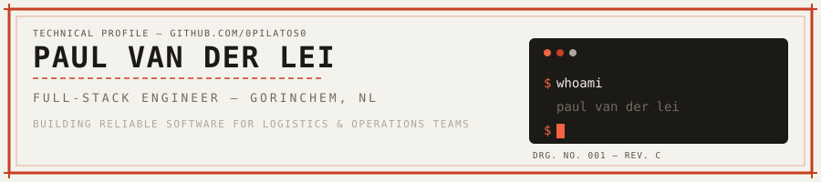

<p align="center">
  
</p>

```js
/**
 * @author Paul van der Lei
 * @location Gorinchem, NL
 * @role Fullstack Engineer
 * @passion Crafting digital experiences
 */
```

<p align="center">
  <a href="https://paulvanderlei.com">
    <!--gh-dark-mode-only-->
    
    <!--gh-light-mode-only-->
    
  </a>
</p>

<p align="center">
  TypeScript-focused engineer building reliable software for logistics and operations teams — currently at <strong>Davanti-WICS</strong>.
</p>

<br>

<p align="center"><strong>core</strong></p>
<p align="center">
  <!--gh-dark-mode-only-->
  
  <!--gh-light-mode-only-->
  
</p>

<p align="center"><strong>backend &amp; data</strong></p>
<p align="center">
  <!--gh-dark-mode-only-->
  
  <!--gh-light-mode-only-->
  
</p>

<p align="center"><strong>platform</strong></p>
<p align="center">
  <!--gh-dark-mode-only-->
  
  <!--gh-light-mode-only-->
  
</p>

<br>

<p align="center">
  <a href="https://paulvanderlei.com">website</a> ·
  <a href="https://www.linkedin.com/in/paul-vanderlei">linkedin</a> ·
  <a href="mailto:paulvanderlei@hotmail.nl">email</a>
</p>
